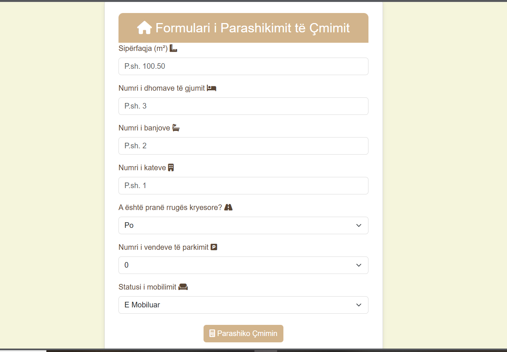
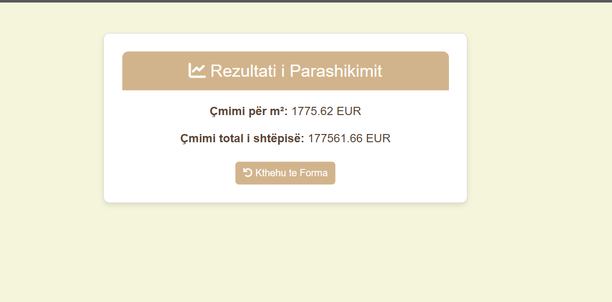

# 🏠 House Price Prediction - North Macedonia

This project predicts house prices in North Macedonia using **Machine Learning** and a custom-built **Flask web UI**.  
It was developed as part of my university coursework in Artificial Intelligence.

---

## 🚀 Features

- 📊 Linear Regression Model
- 🧠 Preprocessing with OneHotEncoder & Pipeline
- 📁 Real housing dataset from Skopje
- 🌐 Flask-powered user interface
- 🎯 Prediction of price per square meter (€/m²)

---

## 📂 Project Structure

```

script/
│
├── app.py                    # Flask app with user form
├── cmimet\_shtepi\_shkup.csv  # Real housing dataset
├── hap1\_shfaq\_dataset.py     # Displays initial dataset
├── hap2\_trajno\_modelin.py    # Trains regression model
├── hap3\_parashiko\_cmimin.py  # Predicts price from input

````

---

## 🖼️ Screenshots

### 🔹 Main UI Form



### 🔹 Result / Prediction Output




## ▶️ How to Run

1. Install dependencies:
```bash
pip install flask pandas numpy scikit-learn
````

2. Run the app:

```bash
python script/app.py
```

3. Open browser and go to:

```
http://127.0.0.1:5000/
```

---

## 👩‍💻 Author

**Jusra Ferati**
Student of Computer Science, SEEU
📍 Skopje, North Macedonia
🔗 [LinkedIn](https://www.linkedin.com/in/jusra-ferati-a35b25254/)

---

## 💡 License

This project is for educational purposes only.

